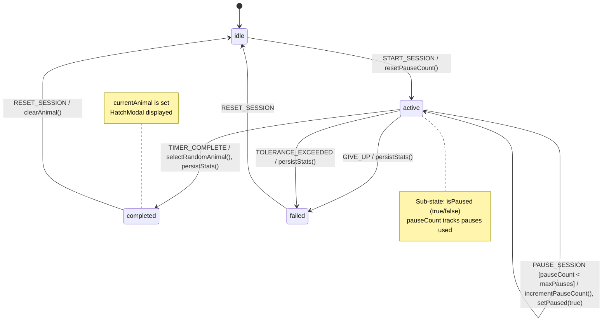
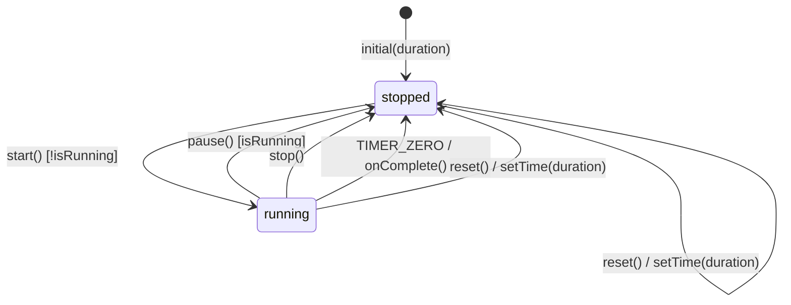
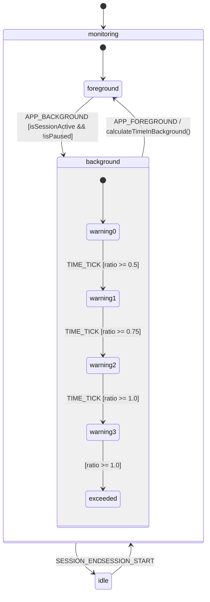
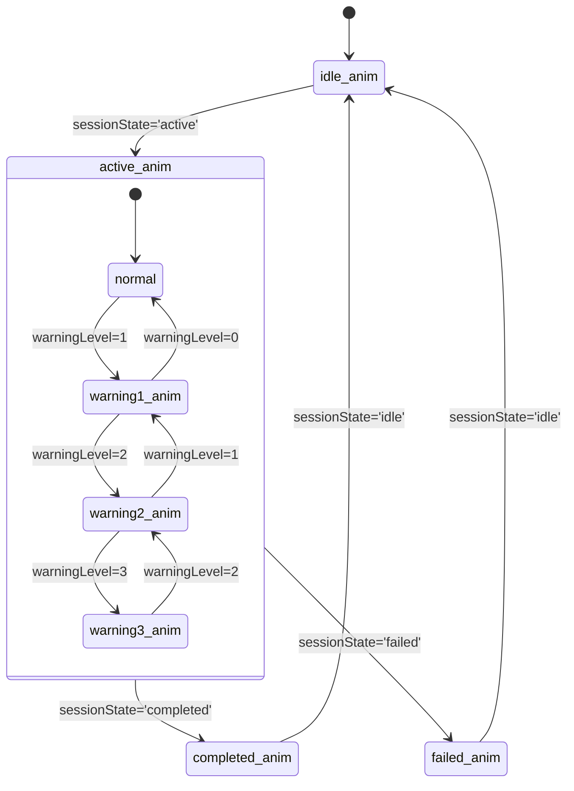

# OvoFocus State Machine Analysis

**Date:** 2026-01-11
**Related Feature:** Core App State Management
**Analyzed Files:**
- `src/context/GameContext.tsx`
- `src/hooks/useTimer.ts`
- `src/hooks/useToleranceSystem.ts`
- `src/components/Egg.tsx`
- `app/index.tsx`

---

## 1. Session State Machine (Primary)

This is the core state machine governing the focus session lifecycle.

### State Diagram (Mermaid)



### ASCII State Diagram

```
                                    +------------------+
                                    |   PAUSE_SESSION  |
                                    | [pauseCount<max] |
                                    |  / incPause()    |
                                    +--------+---------+
                                             |
                      START_SESSION          v
    +-------+      / resetPauseCount()   +--------+
    | IDLE  |-------------------------->| ACTIVE |<----+
    +-------+                            +--------+     |
        ^                                    |          |
        |                                    |     RESUME_SESSION
        |                  +-----------------+     / setPaused(false)
        |                  |                 |
        |    TIMER_COMPLETE|   GIVE_UP /     |
        |    / selectAnimal|   TOLERANCE_    |
        |                  |   EXCEEDED      |
        |                  v                 v
        |            +-----------+    +--------+
        |            | COMPLETED |    | FAILED |
        |            +-----------+    +--------+
        |                  |               |
        +------------------+---------------+
              RESET_SESSION / clearState()
```

### States Enumeration

| State | Description | Entry Conditions | Exit Conditions |
|-------|-------------|------------------|-----------------|
| `idle` | No active session. User can start a new focus session. Timer at initial duration. | App launch, RESET_SESSION | START_SESSION |
| `active` | Focus session in progress. Timer counting down. Egg animating. | START_SESSION | TIMER_COMPLETE, GIVE_UP, TOLERANCE_EXCEEDED |
| `completed` | Session finished successfully. Animal hatched and displayed. | TIMER_COMPLETE | RESET_SESSION |
| `failed` | Session ended prematurely (user gave up or exceeded background tolerance). | GIVE_UP, TOLERANCE_EXCEEDED | RESET_SESSION |

### Sub-State: Pause (within `active`)

| Sub-State | Description |
|-----------|-------------|
| `isPaused: false` | Timer actively counting down |
| `isPaused: true` | Timer paused, user can resume |

### Events Enumeration

| Event | Description | Source |
|-------|-------------|--------|
| `START_SESSION` | User initiates a focus session | UI button press, long-press on egg |
| `PAUSE_SESSION` | User pauses the active session | UI button press |
| `RESUME_SESSION` | User resumes from paused state | UI button press |
| `TIMER_COMPLETE` | Timer reaches zero | useTimer hook |
| `GIVE_UP` | User voluntarily abandons session | UI button with confirmation |
| `TOLERANCE_EXCEEDED` | App was in background too long | useToleranceSystem hook |
| `RESET_SESSION` | User dismisses result, ready for new session | UI button press |

### Transition Table

| Current State | Event | Guard | Next State | Actions |
|--------------|-------|-------|------------|---------|
| idle | START_SESSION | - | active | resetPauseCount(), startTimer(), resetTolerance() |
| active | PAUSE_SESSION | pauseCount < maxPauses | active (isPaused=true) | incrementPauseCount(), pauseTimer() |
| active | PAUSE_SESSION | pauseCount >= maxPauses | (blocked) | button disabled |
| active (paused) | RESUME_SESSION | - | active (isPaused=false) | startTimer() |
| active | TIMER_COMPLETE | - | completed | selectRandomAnimal(), persistToCollection(), incrementStats() |
| active | GIVE_UP | userConfirmed | failed | stopTimer(), persistFailedStats() |
| active | TOLERANCE_EXCEEDED | timeInBackground >= effectiveTolerance | failed | stopTimer(), persistFailedStats() |
| completed | RESET_SESSION | - | idle | resetTimer(), clearCurrentAnimal() |
| failed | RESET_SESSION | - | idle | resetTimer() |

---

## 2. Timer State Machine

Internal state machine within `useTimer` hook.

### State Diagram (Mermaid)



### ASCII State Diagram

```
                    reset() / setTime(duration)
                  +-----------------------------+
                  |                             |
                  v                             |
    +----------+     start()      +---------+  |
    | STOPPED  |----------------->| RUNNING |--+
    +----------+                  +---------+
        ^   ^                         |   |
        |   |    pause() / stop()     |   |
        |   +-------------------------+   |
        |                                 |
        |      TIMER_ZERO / onComplete() |
        +---------------------------------+
```

### States

| State | isRunning | Description |
|-------|-----------|-------------|
| stopped | false | Timer not counting, preserves timeRemaining |
| running | true | Timer actively decrementing |

### Events

| Event | Description |
|-------|-------------|
| start() | Begin countdown from current timeRemaining |
| pause() | Stop countdown, preserve timeRemaining |
| stop() | Stop countdown (alias for pause in current impl) |
| reset() | Stop countdown and reset to initial duration |
| TIMER_ZERO | Internal event when timeRemaining reaches 0 |

---

## 3. Tolerance System State Machine

Monitors app background state and manages tolerance thresholds.

### State Diagram (Mermaid)



### Warning Level States

| Level | Condition | Visual Feedback |
|-------|-----------|-----------------|
| 0 (none) | ratio < 0.5 | Normal egg animation |
| 1 (50%) | 0.5 <= ratio < 0.75 | Yellow warning glow, light haptic |
| 2 (75%) | 0.75 <= ratio < 1.0 | Orange warning glow, medium haptic |
| 3 (100%) | ratio >= 1.0 | Red warning glow, heavy haptic, then FAIL |

### Tolerance Calculation

```
effectiveTolerance = (baseTolerance * progressMultiplier) + streakBonus + shieldBonus

progressMultiplier:
  - 0-25%:   1.0x
  - 25-50%:  1.25x
  - 50-75%:  1.5x
  - 75-100%: 2.0x

streakBonus:
  - 3-6 days:  +5s
  - 7-13 days: +10s
  - 14+ days:  +15s
```

---

## 4. Egg Animation State Machine

Controls egg visual states and animations in `Egg.tsx`.

### State Diagram (Mermaid)



### Animation States

| State | Animations | Description |
|-------|------------|-------------|
| idle | Gentle wobble (-3 to +3 deg), breathing scale (0.98-1.02) | Waiting for user to start |
| active (normal) | Intensifying wobble (2-12 deg based on progress), pulse, glow, sparkles | Session in progress |
| active (warning) | Above + anxious shake + warning pulse glow | Background tolerance warning |
| completed | Intense shake (20 deg), burst scale (0->1.4->0), fade out | Hatching animation |
| failed | Sad shake sequence, shrink to 0.75, fade to 0.3, crack emoji | Failed animation |

---

## 5. Modal/UI State Machines

### HatchModal State Machine

```
+--------+     visible && animal     +----------+
| HIDDEN |-------------------------->| ANIMATING|
+--------+                           +----------+
    ^                                     |
    |          onClose()                  |
    +-------------------------------------+
```

### Gesture Hints Overlay

```
+--------+  !hasSeenGestureHints   +----------+  onDismiss()  +--------+
| HIDDEN |  && session started    | VISIBLE  |-------------->| HIDDEN |
+--------+----------------------->+----------+               +--------+
```

---

## 6. Identified Bugs and Issues

### BUG 1: Timer and Session State Desynchronization (CRITICAL)

**Location:** `app/index.tsx` lines 137-147, 193-207

**Problem:** The timer (`isRunning`) and session state (`sessionState`) are managed separately but must stay synchronized. There's a race condition where:

1. `toleranceExceeded` becomes true
2. Effect triggers `stopTimer()` and `failSession()`
3. But `isRunning` might already be false (e.g., if paused), causing the effect guard `isRunning` to skip the fail

**Evidence:**
```typescript
// Line 137-147
useEffect(() => {
    if (toleranceExceeded && state.sessionState === 'active' && isRunning) {
        stopTimer();
        failSession(elapsedMinutes);
        // ...
    }
}, [toleranceExceeded, state.sessionState, isRunning]);
```

**Impact:** If the user is paused and the tolerance is exceeded while paused (which shouldn't happen per useToleranceSystem), but if AppState detection is buggy, the session won't fail.

**Recommendation:** The guard should be `state.sessionState === 'active'` without requiring `isRunning`, or the tolerance system should handle paused state separately.

---

### BUG 2: Pause Count Can Exceed Max in Emergency Pause (MEDIUM)

**Location:** `app/index.tsx` lines 162-171

**Problem:** `handleEmergencyPause()` calls `pauseSession()` without checking if `pauseCount < maxPauses`. The regular pause button is disabled when max is reached, but emergency pause is not.

**Evidence:**
```typescript
const handleEmergencyPause = () => {
    if (!emergencyPauseUsed && state.sessionState === 'active' && !state.isPaused) {
        pauseTimer();
        pauseSession();  // This increments pauseCount without checking max!
        // ...
    }
};
```

**Impact:** Users could use emergency pause after exhausting regular pauses, exceeding the intended limit.

**Recommendation:** Either:
- Don't increment `pauseCount` for emergency pause (treat separately)
- Or add guard: `pauseCount < maxPauses`

---

### BUG 3: Tolerance System Doesn't Reset timeInBackground on Return (LOW)

**Location:** `src/hooks/useToleranceSystem.ts` lines 122-134

**Problem:** When returning from background, `timeInBackground` is set to the elapsed time but never reset to 0 when the user returns within tolerance. This means `warningLevel` stays elevated until the next background event.

**Evidence:**
```typescript
// Coming back to foreground
if (backgroundStartTimeRef.current && isSessionActive && !isPaused) {
    const timeDiff = Math.floor((Date.now() - backgroundStartTimeRef.current) / 1000);
    setTimeInBackground(timeDiff);  // Set but never cleared
    // ...
}
```

**Impact:** After a valid background return, the warning UI might persist incorrectly.

**Recommendation:** Add `setTimeInBackground(0)` after successful return if not exceeded:
```typescript
if (timeDiff < effectiveTolerance) {
    setTimeout(() => setTimeInBackground(0), 1000); // Clear after brief display
}
```

---

### BUG 4: Missing Transition from Completed/Failed with Timer Still Running (EDGE CASE)

**Location:** `app/index.tsx`

**Problem:** If `RESET_SESSION` is dispatched while the timer interval is still active (unlikely but possible race), the timer continues running in the background.

**Evidence:** `handleReset()` calls `resetTimer()` which clears the interval, but if there's a timing issue where `onComplete` fires during reset, state could be inconsistent.

**Recommendation:** Add explicit `stopTimer()` before `resetTimer()` or ensure `reset()` in useTimer always clears interval first (it does, but verify).

---

### BUG 5: Pause While Paused Race Condition (LOW)

**Location:** `src/context/GameContext.tsx` lines 151-156

**Problem:** `PAUSE_SESSION` always increments `pauseCount`, even if already paused. The UI prevents double-pausing, but programmatic calls could cause over-counting.

**Evidence:**
```typescript
case 'PAUSE_SESSION':
    return {
        ...state,
        isPaused: true,
        pauseCount: state.pauseCount + 1,  // Always increments!
    };
```

**Recommendation:** Add guard in reducer:
```typescript
case 'PAUSE_SESSION':
    if (state.isPaused) return state;  // Already paused, ignore
    return { ...state, isPaused: true, pauseCount: state.pauseCount + 1 };
```

---

### BUG 6: onHatchComplete Never Called in Egg Component (UNUSED)

**Location:** `src/components/Egg.tsx` lines 188-192

**Problem:** The `onHatchComplete` callback is defined in props but the `InteractiveEgg` component doesn't pass it when using `<Egg>`.

**Evidence:**
```typescript
// In Egg.tsx
opacity.value = withDelay(300, withTiming(0, { duration: 400 }, (finished) => {
    if (finished && onHatchComplete) {
        runOnJS(onHatchComplete)();
    }
}));

// In InteractiveEgg.tsx
<Egg
    sessionState={sessionState}
    progress={progress}
    language={language}
    warningLevel={warningLevel}
    // onHatchComplete NOT PASSED
/>
```

**Impact:** The hatch completion callback is never triggered. If any logic depends on it, it won't work.

**Recommendation:** Either remove the unused prop or wire it up properly.

---

### BUG 7: Completed State Shows "Try Again" Button Incorrectly (UI/UX)

**Location:** `src/components/session/SessionControls.tsx` lines 97-105

**Problem:** Both `completed` and `failed` states show the same "Try Again" button, but `completed` should show a different action (the HatchModal handles the main interaction).

**Evidence:**
```typescript
{(sessionState === 'failed' || sessionState === 'completed') && (
    <PixelButton
        title={labels.tryAgain}
        onPress={onReset}
        // ...
    />
)}
```

**Impact:** When session completes, both HatchModal "Add to Collection" and the background "Try Again" button are visible, causing confusion.

**Recommendation:** Don't render "Try Again" when `completed` (HatchModal handles it):
```typescript
{sessionState === 'failed' && (
    <PixelButton title={labels.tryAgain} ... />
)}
```

---

## 7. Edge Cases Analysis

### Edge Case 1: App Killed During Active Session

**Current Behavior:** Session state is lost. On relaunch, app starts in `idle`.

**Recommendation:** Persist session state to AsyncStorage periodically. On app launch, check for interrupted session and offer to resume or discard.

### Edge Case 2: Duration Changed Mid-Session

**Current Behavior:** `useTimer` useEffect resets duration only when `!isRunning`:
```typescript
useEffect(() => {
    if (!isRunning) {
        setTimeRemaining(duration);
        pausedTimeRef.current = duration;
    }
}, [duration, isRunning]);
```

**Assessment:** Correctly handled - duration changes don't affect running sessions.

### Edge Case 3: Double Start Attempt

**Current Behavior:** `useTimer.start()` has guard: `if (isRunning) return;`

**Assessment:** Correctly handled.

### Edge Case 4: Network Failure During completeSession

**Current Behavior:** `completeSession` does multiple async operations without transaction:
```typescript
const updatedCollection = await addToCollection(animal, sessionId);
const updatedStats = await incrementSession(true, focusMinutes);
const updatedDailyProgress = await incrementDailyProgress(state.settings.dailyGoal);
```

**Impact:** If one fails, data could be partially updated.

**Recommendation:** Wrap in try/catch with rollback or use transactions.

---

## 8. State Machine Invariants

These invariants should always hold:

1. **Pause Invariant:** `isPaused === true` implies `sessionState === 'active'`
2. **Animal Invariant:** `currentAnimal !== null` implies `sessionState === 'completed'`
3. **Pause Count Invariant:** `pauseCount <= maxPausesPerSession`
4. **Timer-Session Sync:** `isRunning === true` implies `sessionState === 'active' && !isPaused`
5. **Tolerance Invariant:** `warningLevel > 0` implies `sessionState === 'active' && !isPaused`

---

## 9. Recommendations Summary

| Priority | Issue | Recommendation |
|----------|-------|----------------|
| HIGH | Timer/Session desync | Remove `isRunning` guard from tolerance fail effect |
| MEDIUM | Emergency pause count | Track emergency pause separately |
| MEDIUM | timeInBackground not reset | Clear after valid return |
| LOW | PAUSE_SESSION double-fire | Add reducer guard |
| LOW | Unused onHatchComplete | Remove or wire up |
| UX | "Try Again" on completed | Only show on failed state |

---

## 10. Implementation Notes

When implementing fixes:

1. **State changes should be atomic** - Use reducer batching or single dispatch
2. **Effects should have stable dependencies** - Use `useCallback` for handlers
3. **Guards should be in reducers** - Not just in UI (defense in depth)
4. **Timer state should mirror session state** - Consider merging into single state machine

### Recommended Pattern: XState

For a cleaner implementation, consider migrating to XState which would:
- Enforce state machine transitions at compile time
- Prevent impossible states
- Provide built-in visualization tools
- Handle async actions properly with invoked services

Example XState definition:
```typescript
const sessionMachine = createMachine({
  id: 'session',
  initial: 'idle',
  context: { pauseCount: 0, currentAnimal: null },
  states: {
    idle: { on: { START: 'active' } },
    active: {
      initial: 'running',
      states: {
        running: { on: { PAUSE: { target: 'paused', guard: 'canPause' } } },
        paused: { on: { RESUME: 'running' } }
      },
      on: {
        COMPLETE: 'completed',
        FAIL: 'failed'
      }
    },
    completed: { on: { RESET: 'idle' } },
    failed: { on: { RESET: 'idle' } }
  }
});
```
